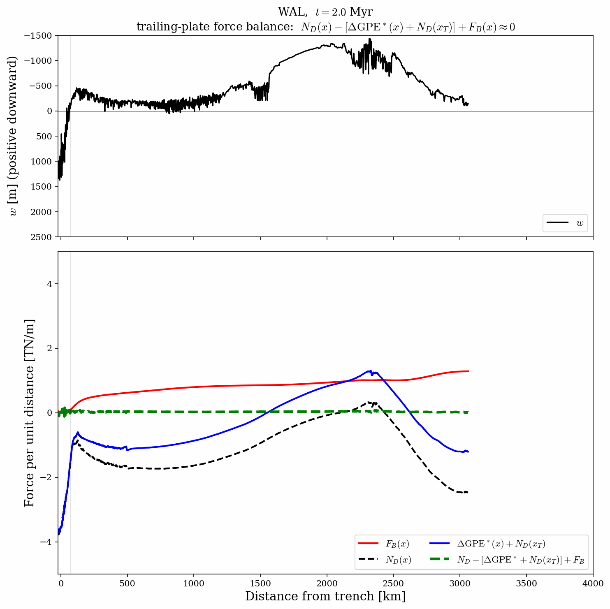

# trench_pull_fluidity

Force-balance analysis of 2D Cerpa et al. Fluidity subduction models, with a focus on the role of trench topography in coupling the slab to the trailing plate.

Analysis presented in the EGU2026 talk: [Re-examining slab pull and trench topography in numerical subduction models](https://meetingorganizer.copernicus.org/EGU26/EGU26-2649.html).



---

## The mathematics

Two integrations of the 2D stress equilibrium equations (Stokes equations) underpin every figure in this repo: a horizontal integration that yields the trailing-plate force balance, and a vertical integration that links surface topography to depth-integrated shear stress.

**Horizontal balance — driving the trailing plate.**  Integrating $\partial_x \sigma_{xx} + \partial_z \sigma_{xz} = 0$ from surface to $z_c$ and from the trench column $x_T$ outward to a column at $x$ gives the trailing-plate balance

$$
\Delta N_D(x) \;-\; \Delta\mathrm{GPE}^{*}(x) \;+\; F_B(x) \;\approx\; 0 ,
$$

with the three resultants

$$
N_D(x) \;=\; \int_0^{z_c} (\tau_{xx} - \tau_{zz})\,dz, \quad
\mathrm{GPE}^{*}(x) \;=\; -\int_0^{z_c} \sigma_{zz}\,dz, \quad
F_B(x) \;=\; \int_{x_T}^{x} \sigma_{xz}(x', z_c)\,dx',
$$

and the column-difference operator $\Delta f(x) \equiv f(x) - f(x_T)$.  $N_D$ measures whether the column is tension-like ($N_D > 0$) or compression-like ($N_D < 0$); $\mathrm{GPE}^{*}$ is minus the column-integrated vertical stress (positive for heavier columns); $F_B$ is the cumulative basal-shear traction integrated outward from the trench.

**Vertical balance — what holds up the topography.**  Integrating $\partial_x \sigma_{xz} + \partial_z \sigma_{zz} = -\rho g$ from the free surface to a fixed integration depth $z_c$, with $\sigma_{zz}(\text{surface}) \approx 0$, gives

$$
\sigma_{zz}(z_c, x) \;=\; -\rho g\,[z_c - z_s(x)] \;-\; \frac{\partial V}{\partial x} ,
$$

where $V(x) = \int_0^{z_c} \sigma_{xz}\,dz$ is the depth-integrated shear stress.  When $\sigma_{zz}$ is approximately uniform on the equipotential at $z_c$ (i.e. *hydrostatic at depth $z_c$*), the surface deflection $w(x)$ relative to a reference column at $x_I$ satisfies $w(x) = (1/\rho_m g)\,\partial_x V$.  The trench-pull figures test this empirically by overlaying $w_\mathrm{actual}(x)$ from the free-surface field against $w_\tau(x) = (1/\rho_m g)\,\partial_x V$.

---

## Two reference-point conventions

Same equation, two ways to anchor it on the plot:

- **§8.2 form** — both $\Delta N_D$ and $\Delta\mathrm{GPE}^{*}$ anchored to zero at the trench:

$$
\Delta N_D(x) \;-\; \Delta\mathrm{GPE}^{*}(x) \;+\; F_B(x) \;\approx\; 0 .
$$

  Easy to read the *shape* of the balance.  But $N_D$'s absolute value disappears — every column is plotted relative to the trench.

- **§8.3 form** — $N_D(x)$ at its absolute value, with the constant $N_D(x_T)$ absorbed into the GPE bracket:

$$
N_D(x) \;-\; \left[\Delta\mathrm{GPE}^{*}(x) + N_D(x_T)\right] \;+\; F_B(x) \;\approx\; 0 .
$$

  Algebraically identical to §8.2.  $N_D(x)$ now reads at its objective per-column value: positive in tension-like columns, negative in compression-like columns, with the zero line carrying physical meaning.  The cost is that the GPE bracket no longer asymptotes to zero — it carries $N_D(x_T)$ as an offset.

The two forms produce closures that differ only by a constant; the residual shape (and the basal-drag term) is identical.  The §8.2 form is better when you want to read the *shape* of the closure off the plot; §8.3 is better when you want $N_D(x)$ itself to convey physical meaning.

---

## Implementation

**Stress interpolation onto a regular grid.**  PVTU node-centred fields are sampled onto a uniform cell-centred grid with `pyvista.StructuredGrid.sample(vtk_data)`.  The grid spans $[x_\min, x_\max] \times [0, Z_\mathrm{MAX}]$ with cell spacing $DX$ in both directions.  Cells outside the model domain are flagged via `interp["vtkValidPointMask"]` and set to NaN.

**Coordinate convention.**  $x$ rightward positive, $z$ downward positive ($z = Y_\mathrm{SURFACE} - y$).  Off-diagonal stress sign flip $\sigma_{xz}^{\,z\text{-down}} = -\sigma_{xy}^{\,y\text{-up}}$ applied at extraction in each notebook's load cell, not buried in any helper.

**Mirror.**  `MIRROR_X = True` flips the model along $x$ via `mirror_fields_in_x` so the subducting plate sits on the right and the slab descends leftward — matches the MDOODZ convention used in the companion `trench_pull_force` repo.  Sign-flips on $\sigma_{xz}$ and $v_x$ are bundled into the helper.

**Quadrature.**  Vertical depth integrals (`N_D`, `Σ_zz`, `V`, `GPE*`) use `numpy.trapz` over the full $[0, Z_\mathrm{MAX}]$ range.  Cumulative basal drag uses `scipy.integrate.cumulative_trapezoid` left-to-right and is then anchored to zero at the trench column (`F_B = FB_ - FB_[tindx]`).

**Trench picker** (`pick_trench_3step`).  Three steps: (1) coarse pressure-min anchor; (2) refined velocity sign-change in a window; (3) directional pressure-min refinement on the subducting-plate side.  Step 2 is mirror-aware: in `MIRROR_X = True` runs the picker selects the *rightmost* zero-crossing of $v_x$ (subducting-plate side), in non-mirrored runs the *leftmost*.

**Ridge picker** (`find_ridge_x`).  Argmax of the lightly-smoothed surface field, restricted to columns seaward of the trench with a buffer to skip the outer-rise bulge.

**Shared helpers** all live in [`notebooks/cerpa_helpers.py`](notebooks/cerpa_helpers.py): `make_field_extractor`, `mirror_fields_in_x`, `pick_trench_3step`, `find_first_isostatic_column`, `find_ridge_x`, `col_avg`, `norm01`, `norm_TR`, `load_records`.  Each notebook's §3 collapses to a single import block.

---

## Configurable parameters

All knobs live in §2 of each notebook (single source of truth), with per-cell overrides flagged inline using `# override:` comments.

**Model selection and grid**

| name | meaning | typical value |
|---|---|---|
| `DATA_ROOT` | path to PVTU directory | `/Users/.../OUTPUTS/` |
| `MODEL_KEY` | `STD` or `WAL` | `'WAL'` |
| `TIMESTEP_INDEX` | 0-indexed snapshot | `10` |
| `DX` | grid spacing (m) | `200` (main notebooks), `500` (`further_analysis/`) |
| `Z_MAX` | grid depth (m) | `75_000` (= 75 km) |
| `Y_SURFACE` | y-coord of model top (m) | `2_900_000` |
| `MIRROR_X` | apply x-mirror | `True` |

**Analysis defaults**

| name | meaning | default |
|---|---|---|
| `INTEGRATION_DEPTH_KM` | depth to which $\sigma_{zz}$ integrals are taken | `75` |
| `SMOOTHWIN` | $\pm$ grid columns averaged around picked columns | `10` |
| `TRENCH_REF_HW_KM` | half-width [km] of the trench-reference average | `10` |
| `WIN_T` | derived: `int(TRENCH_REF_HW_KM * 1000 / DX)` | — |
| `RHO_W`, `rho_m`, `g` | densities and gravity | `0.0`, `3300.0`, `9.8` |

**Plotting**

| name | meaning | default |
|---|---|---|
| `DEPTH_LIM` | axis ylim for depth panels | `(INTEGRATION_DEPTH_KM, 0)` |

`DEPTH_LIM` is *purely* a plot-axis range — it never enters integration math.  Per-cell overrides are allowed for figures that need a different visual depth window.

**Time-evolution-specific** (in `fluidity_time_evolution.ipynb` only)

| name | meaning | default |
|---|---|---|
| `T_ISO_K` | isotherm depth tracked at the trench (Kelvin) | `1173.15` (= 900 °C) |
| `Z_NP_FALLBACK` | fallback if neutral-plane finder fails (m) | `30_000` |
| `RIDGE_BUFFER_KM` | outer-rise buffer for `find_ridge_x` | `200` |
| `RIDGE_SMOOTH_KM` | surface smoothing for `find_ridge_x` | `50` |

---

## Reproducing the figures

The notebooks are the build pipeline.  Workflow:

1. **Point `DATA_ROOT`** in each notebook's §2 at your local copy of the Cerpa data archive.
2. **Time-evolution caches** — run `fluidity_time_evolution.ipynb` once with `MODEL_KEY = 'STD'`, then once with `'WAL'`.  Each populates `notebooks/outputs/time_evolution_<MODEL_KEY>.npz`.  Multi-model figures in §7 then load both caches and don't need the time loop re-run.
3. **Single-step figures** — run `fluidity_single_step.ipynb` at `TIMESTEP_INDEX = 5`, `10`, and `30` to cover all snapshot-specific figures (the talk uses all three).
4. **Per-snapshot frames for the GIF** — `fluidity_time_evolution.ipynb` §9 contains two per-snapshot loops; the §8.3-form loop writes to `figures/force_balance_FD_abs_evolution_<MODEL_KEY>/`.  Convert to a GIF with Pillow or ImageMagick.

The `further_analysis/` notebooks (`fluidity_basal_drag.ipynb`, `fluidity_slab_normal_FD.ipynb`) are not part of the talk's main narrative — run them if you want to verify approximations or simplifications, such as resultants on a slab-normal plane beneath the trench versus on a vertical plane.

---

## Repo layout

```
notebooks/
  fluidity_single_step.ipynb        — main analysis, single timestep
  fluidity_time_evolution.ipynb     — main analysis, time evolution + npz cache
  cerpa_helpers.py               — shared functions (importable from any notebook)
  further_analysis/
    fluidity_basal_drag.ipynb       — approximation test: isotherm vs horizontal plane
    fluidity_slab_normal_FD.ipynb   — approximation test: slab-normal vs vertical plane
  figures/                       — analysis-produced PNGs (canonical home)
  outputs/                       — npz time-evolution caches
zenodo_materials/                — original Cerpa input file + parameter file + README
```

The `further_analysis/` notebooks reach `cerpa_helpers.py` one level up via a small `sys.path.insert(0, "..")` block at the top of their import cell — this is necessary because Jupyter only auto-adds the notebook's own directory to `sys.path`.

---

## Conda environment

Built and tested in `pyvista-env` (numpy, pyvista, matplotlib, scipy, natsort, jupyterlab).  Reproduce with the bundled [`environment.yml`](environment.yml):

```bash
conda env create -f environment.yml
conda activate pyvista-env
python -m ipykernel install --user --name pyvista-env --display-name "Python (pyvista-env)"
```

The `ipykernel install` step is what makes the env visible in JupyterLab's kernel menu; without it, an existing Jupyter installation will silently fall back to whichever kernel it already knows about.  Inside the notebook, select **Kernel → Change Kernel → Python (pyvista-env)**.

---

## Links

**This work**

- **EGU2026 talk** — [EGU26-2649](https://meetingorganizer.copernicus.org/EGU26/EGU26-2649.html).
- **Companion repository** — [`trench_pull_force`](https://github.com/dansand/trench_pull_force) — MDOODZ analysis and preprint source for the same force-balance framework, applied to the AnneloreSubduction setup.
- **Preprint** — *Re-examining slab pull and trench topography*, ESS Open Archive — [doi.org/10.22541/essoar.174413825.53806221/v1](https://essopenarchive.org/doi/full/10.22541/essoar.174413825.53806221/v1).

**Source data and reference paper**

- **Cerpa et al. (2022) paper** — [doi.org/10.1029/2022JB024494](https://agupubs.onlinelibrary.wiley.com/doi/full/10.1029/2022JB024494) — *The effect of a weak asthenospheric layer on surface kinematics, subduction dynamics and slab morphology in the lower mantle.* JGR Solid Earth.
- **Zenodo dataset** — [doi.org/10.5281/zenodo.6817177](https://doi.org/10.5281/zenodo.6817177) — Fluidity input file, parameter file, mesh, and reference STD / WAL outputs.  The parameter file and README from this archive are mirrored verbatim in `zenodo_materials/`.
